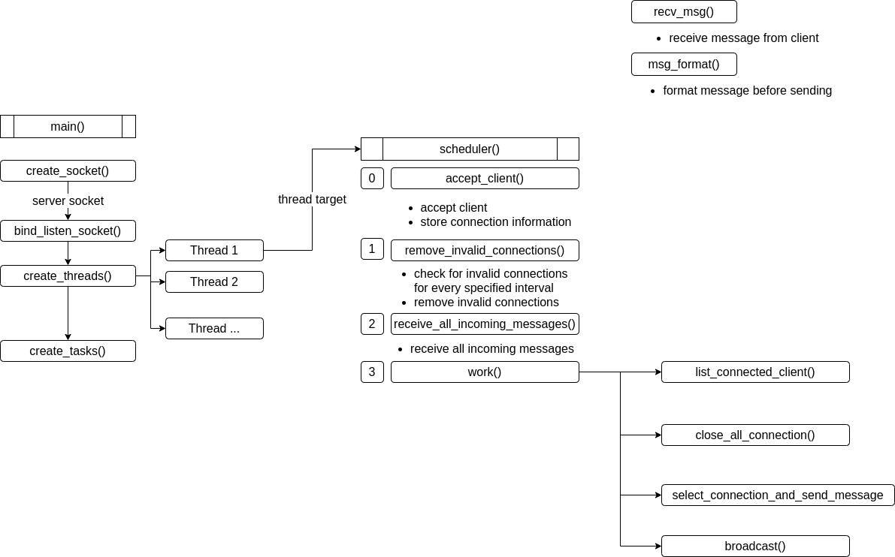
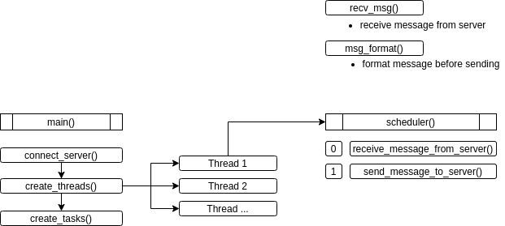

# Multithreaded Chatting Bot

## Scripts
 * Programming language : python 
 * Script for server (multithreading, multiple connections available) 
 * Script for client (multithreading for reading and writing)
 * [script - server](https://github.com/seonwoo960000/skill_stack/blob/main/Chatting%20Bot/scripts/multiserver.py) 
 * [script - client](https://github.com/seonwoo960000/skill_stack/blob/main/Chatting%20Bot/scripts/multiclient.py)

## Server features
 * Multi-threading and scheduling tasks using queue 
 * Multiple connection from clients available
 * Able to send and receive messages simultaneously 
 * Able to connect clients from different networks 

## Client features
 * Able to receive and sent messages concurrently 

## Limitations
 * Confusion in the command line when input message and receiving message come in at the same time
 * Direct communication between client and client isn't available 
*************************************************************************************************************************************
### Server diagram

*************************************************************************************************************************************
### Client diagram

