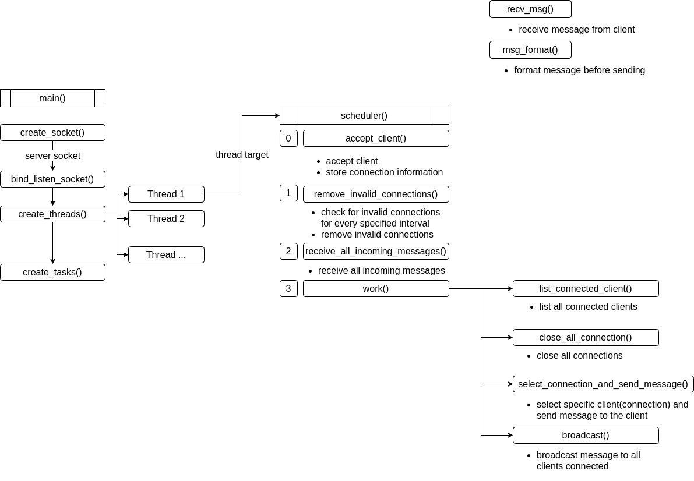

# Chatting Bot application 

## [Flowchart diagram (multiserver.py)](https://github.com/seonwoo960000/skill_stack/blob/main/Chatting%20Bot/scripts/multiserver.py) 
 * Programming language : python 
 * Script for server (multithreading, multiple connections available) 
 * Script for client (multithreading for reading and writing) 

## Features
 * Multi-threading and scheduling tasks using queue 
 * Multiple connection from clients available
 * Able to send and receive messages simultaneously 
 * Able to connect clients from different networks 
